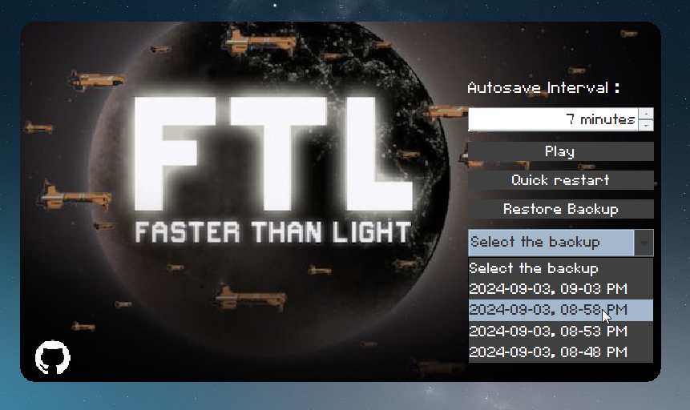
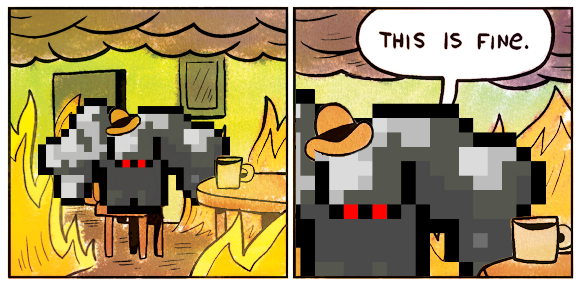

# FTL Autosave Manager 🚀

<div style="display: flex; gap: 20px;">
    
    
</div>

Is the game supposed to be hard? Yes.

Are you supposed to lose because of your mistakes? Also yes.

Is that more fun? probably not.

Fully automatic 1-click autosave manager for **FTL (Faster Than Light)**! 🛠️

## 🚀 Features

- **Autosave Interval**: Customize how often you want your autosaves.
- **Backup Management**: Keep your backups in check. automatic tagged backups.
- **One-Click Restart & Restore**: Quickly get a fresh start or restore from a backup.

## 🛠️ Usage

- Set your autosave interval (in minutes).
- Click “Play” to start FTL and initiate autosave and backup.
- Use “Restart” to refresh your game files from autosave.
- Hit “Restore Backup” to roll back to one of your previous backups.

## 💾 Installation

**1. Download the Ready-to-Use Executable:**

* You can download the pre-built executable from the [Releases page](https://github.com/Koussay-Akchi/FTLAutosaveManager/releases/).

**OR**

1. **Clone the Repo** :

    ```bash
    git clone https://github.com/Koussay-Akchi/FTLAutosaveManager.git
    cd FTLAutosaveManager
    ```

2. **Build** :

    ```bash
    .\gradlew build
    ```

3. **Package** :

    ```bash
    launch4jc.exe .\launch4j-config.xml
    ```

4. **Run the App** :

    ```bash
    .\dist\FTL Autosave Manager.exe
    ```

## 🐛 Bugs & Issues

- If you find any bugs, open an issue or send a pull request. Any criticism is welcome

## 🌟 Contributing

- Want to contribute? Fork the repo, make your changes, and send a pull request. Any change is welcome

---

This is a little side project, it lacks polish but i will update it over time
